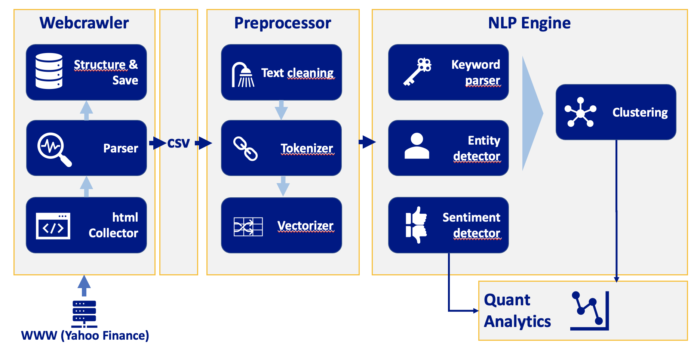

# NLP-Clustering
### Web crawling and NLP engines for clustering of same-event news articles

### Assessment 3 of MA5851 (Data Science Master Class 1) at James Cook University

Author: Sacha Schwab
MIT license

## Quick outline
<ul style="line-height: 1.5; font-size:12pt">
  <li>Crawl Yahoo Finance Cryptocurrency news articles</li>
  <li>Raw text data is preprocessed, embedded (TF-IDF)</li>
  <li>NLP engine runs keyword extraction based on TF-IDF weights, named entity extraction and sentiment analysis</li>
</ul>
See architecture outline at the bottom of this page.

## For class Tutors
<ul style="line-height: 1.5; font-size:12pt">
  <li>Reports are in /main as 'A3_DocumentNumber_X_sacha_schwab<' as per assessment outline/li>
  <li>Code files: (1) 'code_webcralwer.ipynb', (2) 'code_nlp.ipynb'</li>
  <li>Model available under /main/model</li>
   <li>For privacy reasons the audio annotated Powerpoint presentation is not available here but in the assessment folder in JCU Learn</li>
</ul>

## Base requirements
<ul style="line-height: 1.5; font-size:12pt">
  <li>Git</li>
  <li>Python 3.7</li>
  <li>Any IDE supporting Jupyter Notebook files</li>
</ul>

## Deploy
<ul style="line-height: 1.5; font-size:12pt">
  <li>Schedule webcrawler.py code for daily run (ipynb version is for grading)</li>
  <li>Schedule model_update.py for daily run</li>
  <li>TBD: Get connected articles to a new article by running get_cluster from model_run.py</li>
</ul>

## Architecture
 

